<!-- ╔══════════════════════════════════════════════════════════════════════════════╗ -->
<!-- ║                       TACTICAL OPERATIONS PROFILE                          ║ -->
<!-- ║                  NICHOLAS A. CHADWICK  //  @mlcyclops                       ║ -->
<!-- ║              Cloud & Data Technical Lead | AI/ML | Army Veteran             ║ -->
<!-- ╚══════════════════════════════════════════════════════════════════════════════╝ -->

<div align="center">

<!-- ═══════════════════════ HEADER ═══════════════════════ -->



<br>

<!-- ═══════════════════════ TYPING ANIMATION ═══════════════════════ -->

<a href="https://github.com/mlcyclops">
  
</a>

<br>

<!-- ═══════════════════════ SOCIAL BADGES ═══════════════════════ -->

<a href="https://www.linkedin.com/in/nickchadwick-techlead187/">
  
</a>
&nbsp;
<a href="mailto:Nicholas.Chadwick.ctr@gmail.com">
  
</a>
&nbsp;
<a href="https://aiworkshopapps.com/">
  
</a>
&nbsp;
<a href="https://github.com/mlcyclops">
  
</a>

<br><br>


</div>

<br>


<br>

<!-- ═══════════════════════ MISSION BRIEFING ═══════════════════════ -->

## 🎯 MISSION BRIEFING

```
┌──────────────────────────────────────────────────────────────────────────────────┐
│  CLASSIFICATION: UNCLASSIFIED // FOUO                                            │
│  SUBJECT:        OPERATOR PROFILE — NICHOLAS A. CHADWICK                         │
│  STATUS:         ██████████████████████████████████████████ ACTIVE                │
│  CLEARANCE:      TS/SCI (SSBI)  |  IAM III  |  IAT III                          │
└──────────────────────────────────────────────────────────────────────────────────┘
```

> **Enabling National Security organizations to operationally adopt AI/ML** in challenging, changing, and harsh environments where network and internet connectivity is limited.

<table>
<tr>
<td>🏗️</td>
<td>Accredited the <b>first GCP cloud enclave</b> including Kubernetes (GKE), Google IAM &amp; Workspace at <b>IL5 for the USAF</b></td>
</tr>
<tr>
<td>🔬</td>
<td><b>Principal Investigator</b> for Army advanced R&amp;D — <b>Predictive Logistics</b> using AI agents built on <b>Google Gemini &amp; Gemma</b></td>
</tr>
<tr>
<td>🗺️</td>
<td>Technical advisor to <b>Army Futures Command (AFC)</b> for Next Generation C2 — <b>NGC2 Project Trinity</b></td>
</tr>
<tr>
<td>🧠</td>
<td>Primary <b>GenAI enterprise leader</b> — hands-on workshops on GenAI integration across all departments</td>
</tr>
<tr>
<td>🎖️</td>
<td><b>24+ years</b> of military &amp; defense technology service (8 Active, 16 Reserve)</td>
</tr>
<tr>
<td>🏆</td>
<td><b>AFCEA 40 Under 40</b> &amp; <b>AUSA Innovation Command Officer of the Year</b> (2019)</td>
</tr>
</table>

<br>


<br>

<!-- ═══════════════════════ COVERT CONSORTIUM ═══════════════════════ -->

<div align="center">

##  &nbsp; COVERT CONSORTIUM

</div>

<table>
<tr>
<td width="140" align="center">
  <a href="https://aiworkshopapps.com/">
    
  </a>
  <br><br>
  <a href="https://aiworkshopapps.com/">
    
  </a>
</td>
<td>

### Civilian On-ramp for Veteran Engineering, Rapid Transition

An **exclusive, rank- and service-agnostic ecosystem** of veteran builders accelerating **Generative AI adoption** within the military community. We bridge the gap between institutional speed and technological reality.

🔗 **[aiworkshopapps.com](https://aiworkshopapps.com/)** — Where veterans **build, test, and deploy** practical AI

**Core Principles:**

| | Principle | Description |
|---|---|---|
| ⚡ | **Action Over Talk** | Working artifacts and measurable progress — no slides |
| 🎯 | **Build With Purpose** | Practical AI outcomes to the tactical edge |
| 🤝 | **Uplift &amp; Mentor** | Operators evolving into technologists |
| 🔐 | **Security &amp; Trust** | Safe demo practices, NDA-protected community |

</td>
</tr>
</table>

<br>


<br>

<!-- ═══════════════════════ TECH ARSENAL ═══════════════════════ -->

<div align="center">

## ⚔️ TECH ARSENAL

<br>

### ☁️ Cloud Platforms

<a href="#"></a>
<a href="#"></a>
<a href="#"></a>

### 🤖 AI &amp; Machine Learning

<a href="#"></a>
<a href="#"></a>
<a href="#"></a>
<a href="#"></a>
<a href="#"></a>
<a href="#"></a>
<a href="#"></a>

### 🏗️ Infrastructure &amp; DevOps

<a href="#"></a>
<a href="#"></a>
<a href="#"></a>
<a href="#"></a>
<a href="#"></a>
<a href="#"></a>

### 🛡️ Security &amp; Compliance

<a href="#"></a>
<a href="#"></a>
<a href="#"></a>
<a href="#"></a>
<a href="#"></a>
<a href="#"></a>
<a href="#"></a>
<a href="#"></a>

### 📊 Data Architecture

<a href="#"></a>
<a href="#"></a>
<a href="#"></a>
<a href="#"></a>
<a href="#"></a>
<a href="#"></a>

</div>

<br>


<br>

<!-- ═══════════════════════ MISSION LOG ═══════════════════════ -->

## 📋 MISSION LOG

<details>
<summary>
  <b>🟢 ACTIVE OPS — Cloud &amp; Data Technical Lead | Next Tier Concepts</b>&nbsp;&nbsp;<kbd>12/2021 – Present</kbd>
</summary>

<br>

> **National Security &amp; Defense** — Enable National Security organizations to operationally adopt AI/ML in challenging, changing, and harsh environments where network and internet connectivity is limited.

**Key Operations:**

| Status | Operation |
|:---:|---|
| ✅ | Accredited the **first GCP cloud enclave** (Kubernetes/GKE, Google IAM &amp; Workspace) at **IL5 for the USAF** |
| 🔬 | **Principal Investigator** for Army advanced R&amp;D — Predictive Logistics using AI agents on **Google Gemini &amp; Gemma** under Agile Scrum |
| 📊 | Lead team developing **synthetic datasets** for knowledge graph data platform on **edge hardware** with CI/CD predictive forecasting |
| 🛡️ | Technical managerial leadership for **DataOps &amp; MLOps Kubernetes platform** in classified enclave for Intelligence customer |
| 🗺️ | Technical advisor to **AFC** for **NGC2 Project Trinity** — Google Maps-like Mission Command UI for edge users |
| 🧠 | Primary **GenAI enterprise leader** — hands-on workshops on GenAI integration across all departments |

**Tech Stack:**


</details>

<details>
<summary>
  <b>🔵 COMPLETED — Senior Cloud Architect | Atlantic Digital (USSOCOM)</b>&nbsp;&nbsp;<kbd>08/2016 – 12/2021</kbd>
</summary>

<br>

> **U.S. Special Operations Command** — Tampa, FL — Architected cloud-native solutions for cloud-to-edge and cloud-to-core hybrid connections for USSOCOM HQ and components.

**Key Operations:**

| Status | Operation |
|:---:|---|
| 🤖 | Collaborated with **Google** to develop, test, deploy **Google Cloud AutoML** containerized Computer Vision for remote edge systems |
| 🎯 | Supported **Army Special Operations AI Division**, Naval Special Warfare, and **160th SOAR** with cloud services &amp; AI tools |
| 📐 | Implemented **Infrastructure-as-Code (IaC)** with open-source and cloud provider tools |
| 📊 | Supported USSOCOM **CDO &amp; Chief Data Scientist** in certifying Data Science tools for classified, disconnected environments |
| 🏛️ | Worked on **Zero Trust Architecture**, Edge-to-Cloud Computing, IoT Security, and ML solutions |

**Tech Stack:**


</details>

<details>
<summary>
  <b>🟠 ONGOING — Innovation Engineer &amp; Cloud Architect | U.S. Army &amp; Army Reserve</b>&nbsp;&nbsp;<kbd>10/2000 – Present</kbd>
</summary>

<br>

> **World-wide Locations / Orlando, FL** — 24+ years of service across Active Duty (8 years) and Army Reserve (16 years)

**Key Operations:**

| Status | Operation |
|:---:|---|
| 🗣️ | Technical support for first **AI-powered Natural Language Translation** from Army Research Lab during **PSYOP Task Force Iraq** (2006 "The Surge") |
| 📡 | Utilized **COMSAT, radio networking, and 5G edge solutions** across 24+ years of global operations |
| 🔮 | Expert evaluator for **Cyber CDID at AFC** for next-gen **Zero Trust, SATCOM, AutoPACE AI/ML** networking (2024-2025) |
| 🎓 | Mentored junior CWOs and CPT-LTCs in technical careers, public sector DevSecOps, hybrid cloud, and Digital Engineering |
| 🌐 | Support **Army Futures Command** and Reserves in adopting **AI, cybersecurity, Zero Trust, and process automation** |

**Tech Stack:**


</details>

<br>


<br>

<!-- ═══════════════════════ CREDENTIALS ═══════════════════════ -->

<div align="center">

## 🎓 CREDENTIALS

<br>

### Certifications &amp; Compliance

<table>
<tr>
<td align="center" width="120">
  <br>
  <sub><b>ISC²</b></sub>
</td>
<td align="center" width="120">
  <br>
  <sub><b>CompTIA</b></sub>
</td>
<td align="center" width="120">
  <br>
  <sub><b>Cloud Solutions</b></sub>
</td>
<td align="center" width="120">
  <br>
  <sub><b>Google Cloud</b></sub>
</td>
</tr>
<tr>
<td align="center" width="120">
  <br>
  <sub><b>Google</b></sub>
</td>
<td align="center" width="120">
  <br>
  <sub><b>Cisco Systems</b></sub>
</td>
<td align="center" width="120">
  <br>
  <sub><b>DoDI 8570</b></sub>
</td>
<td align="center" width="120">
  <br>
  <sub><b>DoDI 8570</b></sub>
</td>
</tr>
</table>

<br>

### Education

| Institution | Program |
|:---:|---|
| 🎓 **University of Toledo** | BBA in Accounting &amp; Information Systems |
| 🎖️ **U.S. Army Cyber CoE** | Network Engineer, Cyber Defense, CEH, CISSP, Cisco Academy, SATCOM, VMware, Linux |

</div>

<br>


<br>

<!-- ═══════════════════════ PUBLICATIONS ═══════════════════════ -->

## 📡 INTEL REPORTS

```
DISSEMINATION: APPROVED FOR PUBLIC RELEASE
```

| # | Publication | Source |
|:---:|---|:---:|
| 📄 | [**The Future of Military Logistics: AI, Data Models, and Emerging Technologies**](https://www.ntconcepts.com/next-talks/the-future-of-military-logistics-ai-data-models-and-emerging-technologies/) | NT Concepts |
| 📄 | [**Digital Engineering Tools for Efficient AI Development**](https://www.ntconcepts.com/digital-engineering-tools-for-efficient-ai-development/) | NT Concepts |
| 📄 | [**Fight and Win in Contested Multi Domain Operations**](https://archive.smallwarsjournal.com/jrnl/art/mad-science-fiction-fight-and-win-contested-multi-domain-operations) | Small Wars Journal |
| 📄 | [**Cloud-Agnostic Data Management Solutions**](https://www.ntconcepts.com/cloud-agnostic-data-management-solutions/) | NT Concepts |
| 📄 | [**Data Management Design Patterns for Cloud Ecosystems**](https://www.ntconcepts.com/data-management-cloud-design-patterns-for-cloud-ecosystems/) | NT Concepts |

<br>


<br>

<!-- ═══════════════════════ GITHUB STATS ═══════════════════════ -->
<!-- TODO: Uncomment this section when GitHub activity improves

<div align="center">

## 📊 OPERATIONAL METRICS

<br>

<a href="https://github.com/mlcyclops">
  
</a>
<a href="https://github.com/mlcyclops">
  
</a>

<br><br>

<a href="https://github.com/mlcyclops">
  
</a>

<br><br>

<a href="https://github.com/mlcyclops">
  
</a>

</div>

<br>


<br>
-->

<!-- ═══════════════════════ COMMENDATIONS ═══════════════════════ -->

<div align="center">

## 🏅 COMMENDATIONS

<br>

<table>
<tr>
<td align="center" width="50%">
  <h3>🏆 AFCEA 40 Under 40</h3>
  <kbd>2019</kbd>
  <br><br>
  <sub>Armed Forces Communications &amp; Electronics Association</sub>
</td>
<td align="center" width="50%">
  <h3>⭐ Innovation Command Officer of the Year</h3>
  <kbd>2019</kbd>
  <br><br>
  <sub>AUSA Sunshine Chapter — 75th Innovation Command</sub>
</td>
</tr>
</table>

</div>

<br>


<br>

<!-- ═══════════════════════ COMMUNITY OPS ═══════════════════════ -->

## 🤝 COMMUNITY OPS

<table>
<tr>
<td>

| Role | Organization | Period |
|---|---|:---:|
| 🎖️ **Technology Chair** | AFCEA Greater Tampa Bay Chapter | 2019-2021 |
| 🎓 **CS Advisory Board Rep** | Hillsborough Community College | Active |
| 🤖 **Student Mentor** | AMRoC (Advanced Manufacturing &amp; Robotics) | 2019-2021 |
| 🏆 **IoT/AI Finalist Mentor** | FedTech xTechSearch | — |
| ☁️ **Edge/Cloud SME Mentor** | AFWERX Fusion | 2019 |
| 🛡️ **Active Member** | [**COVERT Consortium**](https://aiworkshopapps.com/) | Active |

</td>
<td width="180" align="center">

<a href="https://aiworkshopapps.com/">
  
</a>

<br><br>

<a href="https://aiworkshopapps.com/">
  
</a>

<br>

<sub><b>Where Veterans Build AI</b></sub>
<br>
<sub>Do, Not Talk.</sub>

</td>
</tr>
</table>

<br>


<br>

<!-- ═══════════════════════ CONNECT ═══════════════════════ -->

<div align="center">

## 📡 ESTABLISH COMMS

<br>

```
┌─────────────────────────────────────────────────────────┐
│  Ready to collaborate on AI, Cloud, or Defense tech?    │
│  Open a channel below.                                  │
└─────────────────────────────────────────────────────────┘
```

<br>

<a href="https://www.linkedin.com/in/nickchadwick-techlead187/">
  
</a>
&nbsp;&nbsp;
<a href="mailto:Nicholas.Chadwick.ctr@gmail.com">
  
</a>
&nbsp;&nbsp;
<a href="https://aiworkshopapps.com/">
  
</a>
&nbsp;&nbsp;
<a href="https://github.com/mlcyclops">
  
</a>

<br><br>

</div>

<!-- ═══════════════════════ FOOTER ═══════════════════════ -->



<!-- ═══════════════════════ END ═══════════════════════ -->
